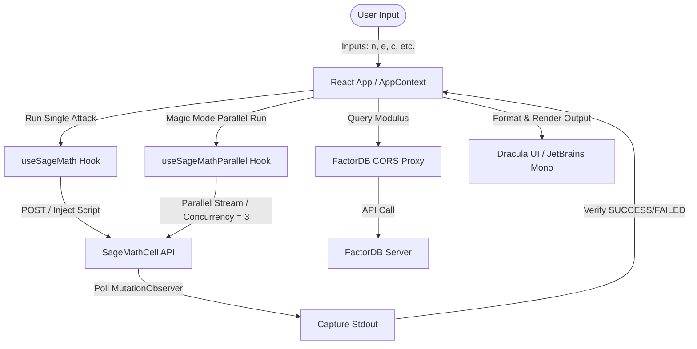

# RsaWebTool — Comprehensive Codebase Analysis & Reference Guide

Welcome to the **RsaWebTool** codebase analysis. This document serves as the comprehensive, state-of-the-art reference guide for the codebase, architecture, attack integrations, and development practices used within the project. 

---

## 🏛️ System Architecture Overview

**RsaWebTool** is a high-performance, browser-only cryptanalysis workbench for solving RSA-related CTF and cryptography challenges. The tool is fully static, running directly on GitHub Pages with zero backend dependencies, and leverages two key external microservices:

1. **SageMathCell Public Service (`https://sagecell.sagemath.org`)**
   - Renders and runs mathematical algorithms inside isolated containers in the browser.
   - Operates with a **30-second execution timeout** and firewall rules that block outbound internet access.
   - Code execution is initiated through dynamic generation of Sage scripts from templates in `src/attacks/`.

2. **FactorDB Client (CORS Proxied)**
   - Queries `http://factordb.com` to check if a modulus $n$ has precomputed factors.
   - Uses a custom Cloudflare Worker proxy (`https://factordb-proxy.octopusyuzu.workers.dev`) to bypass CORS restrictions.



---

## 📁 Directory Structure & Key Entry Points

The codebase is organized logically into React components, custom Hooks, math-oriented utility files, and modular attack specifications.

| Path | Description / Key Functions |
| :--- | :--- |
| **`index.html`** | Loads the embedded SageMathCell script tag, defines the browser viewport, and mounts the React root element. |
| **`src/main.tsx`** | Entry point for mounting the React app into `#root`. |
| **`src/App.tsx`** | Top-level layout. Integrates `Sidebar`, `InputPanel`, `MagicPanel`, `ProofIndex`, `RsaCalculator`, and `OutputPanel`. Saves user-configured output width in `localStorage`. |
| **`src/config.ts`** | External environment configuration (e.g., FactorDB CORS proxy URL). |
| **`src/types/`** | Contains basic TypeScript typing declarations (e.g., `Attack`, `InputField`, `SageResult`). |
| **`src/theme/dracula.ts`** | Custom Material UI theme definition following a high-end Dracula color palette. |
| **`src/context/AppContext.tsx`** | App-wide state sharing (active view, chosen attack, current execution status, past challenge history). |
| **`src/hooks/useSageMath.ts`** | Core executor hook. Creates offscreen DOM containers, injects `<script type="text/x-sage">`, polls for completion with a `MutationObserver`, and handles parallel execution with a concurrency limit of 3. |
| **`src/utils/bigint.ts`** | Native TypeScript implementation of fast BigInt arithmetic: GCD, ModPow, ModInverse, Integer Sqrt (`isqrt`), and Extended GCD. |
| **`src/utils/factordb.ts`** | CORS-proxied client interacting with FactorDB to fetch prime factorization values. |
| **`src/utils/testcases/`** | Random prime and key pair generators (`randomPrime()`, `isPrimeMR()`, `encrypt()`) for seeding test case fields. |
| **`src/attacks/`** | Modulized directory containing **52 independent attack files** and `index.ts` barrel. |
| **`workers/`** | Node-based Cloudflare Wrangler project containing the FactorDB CORS Proxy code. |
| **`docs/`** | Built production artifacts (directly pushed to `main` for GitHub Pages hosting). |

---

## ⚔️ Modular Attack System

Every attack resides in `src/attacks/` and adheres to a strict interface, exporting:
1. `attack`: An object of type `Attack` defining metadata, input parameters, SageMath script templates, and LaTeX math proofs.
2. `generateTestcase`: An optional function yielding test case variables for mock testing.

### 52 Attacks Categorized

The 52 attacks are divided into 5 clear sections within the sidebar:

#### 1. Factorization
Designed to find factors $p, q$ of the modulus $n$.
* **`fermat`**: Fermat Factorization (when $|p - q| < 2n^{1/4}$).
* **`wiener`**: Wiener's Continued Fraction attack (when $d < \frac{1}{3}n^{1/4}$).
* **`boneh-durfee`**: Boneh-Durfee lattice-based attack (when $d < n^{0.292}$).
* **`ecm` / `ecm2`**: Elliptic Curve Method factorization.
* **`pollard-p1`**: Pollard's $p-1$ attack (when $p-1$ has small prime factors).
* **`pollard-rho`**: Pollard's Rho factorization (for general small factors).
* **`williams-p1`**: Williams' $p+1$ factorization.
* **`quadratic-sieve`**: Quadratic Sieve factorization.
* **`squfof`**: Shanks' Square Forms Factorization.
* **`binary-poly-factor`**: Factoring using binary polynomial techniques.
* **`small-fraction`**: Small fraction factorization ($p/q \approx a/b$).
* **`batch-gcd`**: Factoring multiple moduli sharing common prime factors.
* **`multi-prime`**: Decrypting multi-prime RSA ($n = p \cdot q \cdot r \dots$).
* **`gimmicky-primes`**: Factoring prime patterns like Mersenne primes, Fibonaccis.
* **`close-prime`**: Fermat-variant factoring when primes are very close.
* **`novelty-primes`**: Factoring known prime structures.

#### 2. Partial Key / Lattice
Uses Coppersmith's lattice reduction methods (LLL/HNP) to recover private keys or cleartext given partial data leaks.
* **`simple-lattice`**: Standard LLL-based polynomial solver.
* **`partial-d`**: Recovering message/modulus given fractional bits of exponent $d$.
* **`partial-pq-bits`**: Factoring modulus $n$ when high-order or low-order bits of $p$ or $q$ are leaked.
* **`small-crt-exp`**: LLL solving when private CRT exponents $d_p$ or $d_q$ are small.
* **`dp-dq-leak`**: Fast recovery when both CRT private exponents $d_p$ and $d_q$ are leaked.
* **`linearly-related-primes`**: Modulus factoring when relation $q = a \cdot p + b$ is known.
* **`dependent-prime`**: Solving when $p$ and $q$ share linear patterns.
* **`partial-key-exposure`**: Classic Coppersmith-based partial $d$ solver.
* **`implicit-key-exposure`**: Exploiting implicit relations between multiple private keys.

#### 3. Message / Protocol
Exploits mathematical flaws in message pad, public exponent $e$, or protocol configuration.
* **`common-modulus`**: Decrypting when two messages are encrypted under the same modulus $n$ but different exponents $e_1, e_2$.
* **`hastad`**: Hastad's Broadcast attack (decrypting identical messages sent to $e$ receivers).
* **`franklin-reiter`**: Franklin-Reiter Related Message attack (when two messages share a linear relation: $m_2 = a \cdot m_1 + b$).
* **`coppersmith-short-pad`**: Coppersmith's Short Pad attack (when small padding is appended to the message).
* **`hastad-linear-pad`**: Broadcasters employing linear message padding.
* **`rsa-crt-fault`**: Boneh-Demillo-Lipton fault injection attack (recovering $p$ when a signature generation under CRT fails/glitches).
* **`non-coprime-exp`**: Decrypting when $\gcd(e, \phi(n)) > 1$ (uses division of exponents).
* **`cube-root-crt`**: Recovering cleartext using CRT root extractions.
* **`common-factor`**: Multi-key cracking via common factor detection.
* **`homomorphic-forgery`**: Forging valid signatures using multiplicative homomorphism.
* **`bleichenbacher-sig`**: Exploiting bad PKCS#1 v1.5 padding verification in signatures (e.g. key length mismatches).
* **`known-plaintext`**: Coppersmith-based recovery when portion of plaintext is known.
* **`small-public-exp`**: Exploiting very small public exponents (e.g. $e = 3$) when $m^e < n$.
* **`related-message`**: General related-message solver.
* **`hastad-broadcast`**: Broadcast solver variant.

#### 4. Oracle
Uses decryption or padding oracles to leak plaintext byte-by-byte or bit-by-bit.
* **`lsb-oracle`**: Least Significant Bit (LSB) oracle attack (halving interval search).
* **`bleichenbacher`**: Bleichenbacher's Padding Oracle attack (million message attack against PKCS#1 v1.5).
* **`manger`**: Manger's Oracle attack against OAEP padded messages.
* **`biased-lsb`**: Oracles leaking slightly biased LSB distributions.
* **`parity-oracle`**: Parity oracle decryption helper.

#### 5. Advanced
Modern and specialized attacks.
* **`roca`**: Return of Coppersmith's Attack (ROCA) on Infineon RSALib ($p$ conforms to $k \cdot M + (6^a \bmod M)$).
* **`nitros`**: Attacks on specific cryptosystem implementations.
* **`factordb-lookup`**: Querying FactorDB to see if third-party databases already have the factorizations.
* **`multi-prime-gcd`**: Exploiting gcd relationships in multi-prime setups.
* **`phi-leak`**: Solver using leaked Euler totient $\phi(n)$ values.
* **`common-prime-rsa`**: Factoring when key pairs share prime factors.

---

## ⚡ SageMath Execution Pipeline

SageMathCell does not provide a reliable REST service due to strict Cloudflare CORS blocks (HTTP 520 errors on the `/service` endpoint). Instead, **RsaWebTool** embeds the official `embedded_sagecell.js` SDK and automates it through an offscreen DOM container injection method:

1. **Offscreen Container**: Creates a hidden `div` with absolute offscreen coordinates (`-9999px`).
2. **Script Injection**: Inserts a script element containing the constructed SageMath template: `<script type="text/x-sage">`.
3. **Execution Call**: Calls `window.sagecell.makeSagecell()` targeting the hidden element. This invokes SageMathCell's internal WebSocket connection to send code to Sage backend runners.
4. **Mutation Polling**: Sets a `MutationObserver` on the offscreen container to detect the appearance of `.sagecell_stdout`. Once stdout updates and settles, the text content is extracted and parsed.
5. **Auto-Timeout**: If the execution fails to produce output within 35 seconds, the hook cancels the observer and returns an execution timeout message.

### Concurrency Engine (`useSageMathParallel`)
For **Magic Mode** (where all 52 attacks are assessed in parallel), RsaWebTool employs a custom queue manager:
- **Maximum Concurrency**: Capped at **3 concurrent executions** in parallel.
- **Dynamic Queue**: Pushes all templates into a queue. As soon as a slot clears, the next SageMath code execution is dispatched.
- **Instant Abort**: If any attack reports `[ATTACK_ID]=SUCCESS` (e.g. `FERMAT=SUCCESS`), an `AbortController` triggers, instantly canceling the remaining 49+ pending evaluations to conserve CPU and network resources.

---

## ⚠️ SageMath Cell Gotchas (Hard-Earned Lessons)

When writing or editing templates inside `src/attacks/`, keep these strict SageMath rules in mind:

> [!CAUTION]
> **No Blank Lines inside Indented Blocks**
> SageMath Cell's interactive interpreter treats completely blank lines within functions, `try/except` statements, or loops as block terminators. This immediately triggers a `SyntaxError: unexpected indent` or `break/return outside loop`. **Never** include blank lines inside indented blocks!

* **Exponentiation**: Python `^` is XOR for integers. **Always** use `**` for exponentiation (e.g. `base ** exp`).
* **Integer Wrappers**: Dynamic input values are treated as Python floats or strings. Wrap all dynamic template values in `Integer(...)` (e.g. `n = Integer(${vals.n})`).
* **Exit Commands**: Do not use `return` at the module level. Use `quit()` instead to exit the script early (e.g. inside guards like `if n % 2 == 0: quit()`).
* **Nth Root Calculation**: `Integer` objects do not have `.integer_nth_root()`. Use `n.nth_root(r)` inside a `try/except` guard.
* **Continued Fraction**: `Integer` objects do not have a `.continued_fraction()` method. Call the global function instead: `continued_fraction(QQ(e)/QQ(n))`.
* **State Mutation in Oracles**: When simulating oracle attacks inside templates, preserve the original ciphertext: `orig_c = Integer(${vals.c})` before performing loop mutations.
* **Timeout Constraints**: Factorization templates should prioritize fast checks or limit iterations (e.g., maximum loops of $10^6$) to prevent running past the 30-second cell limit.

---

## 🎨 Design Tokens & UI Aesthetics

RsaWebTool uses a dark, visual-first Dracula palette, matching premium modern web aesthetics.

```
Dracula Accent Tokens:
  Primary Accent:   #bd93f9 (Purple)
  Secondary Hover:  #ff79c0 (Pink)
  Active / Tech:    #8be9fd (Cyan)
  Success State:    #50fa7b (Green)
  Warning State:    #ffb86c (Orange)
  Error State:      #ff5555 (Red)
```

### Layout Boundaries
- Monospace UI matching terminal outputs.
- Typography strictly inherits `'JetBrainsMono Nerd Font', monospace`.
- Borders and background solid-shading are used rather than heavy CSS drop-shadows to preserve a flat, technical workbench theme.
- **Scrollbars**: Customized to a sleek Dracula layout (`12px` width, with transparent padding-box borders to avoid layout shifts).

---

## 🛠️ Verification & Maintenance Checklist

When performing work, debugging, or introducing new attacks to the codebase, verify changes in this sequence:

### 1. Verification Flow
Before committing, always run:
```bash
# Typecheck TypeScript for compiler errors
bun run typecheck

# Check lint rules
bun run lint

# Build production bundle to docs/
bun run build
```

### 2. Fast Deployment Flow
GitHub Pages automatically deploys from the `/docs` subdirectory. Remember that `docs/` is gitignored by default, requiring the `-f` force flag:
```bash
bun run build
git add -f docs/          # CRITICAL: Forces staging of compiled docs
git add -A
git commit -m "feat: your contribution"
git push origin main
```

### 3. Automated Docker Verification
A comprehensive test suite is available in `scratch/test_all_attacks_docker.ts`. This script tests all 52 attacks against a containerized `sagemath/sagemath` environment. All attacks have been mathematically verified to pass this test suite.
